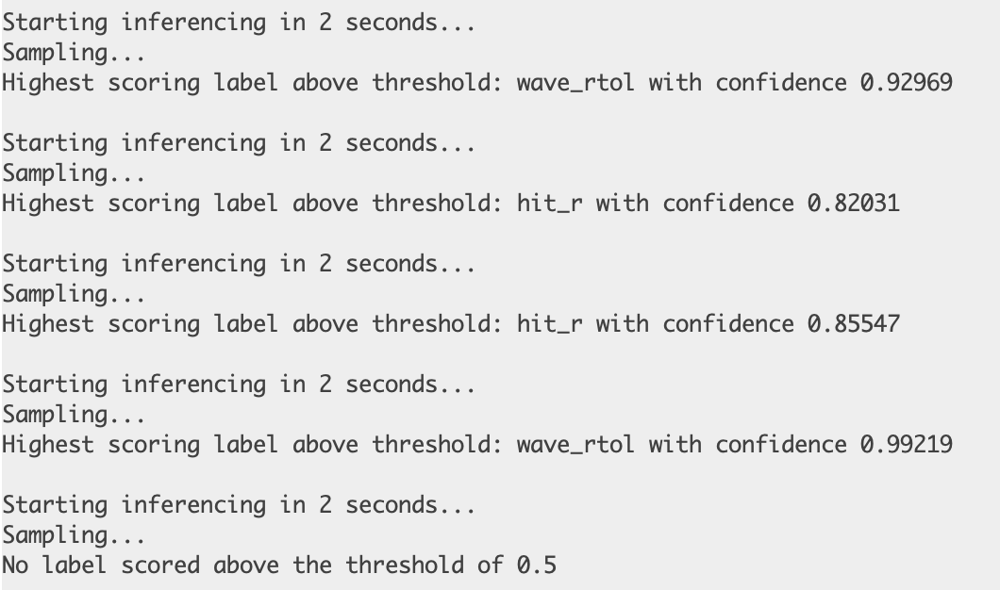

# 👋🏻🚦 Gesture-Controlled Traffic Baton

> Sheau-Jwu Esther Wu,  [Edge Impulse projects](https://studio.edgeimpulse.com/public/378369/live)

 

## Introduction 

Traffic management is a critical component of urban planning, affecting everything from daily commutes to emergency responses. Traditional traffic light systems and manual control by traffic officers have limitations, particularly in dynamic or unusual traffic conditions. The Gesture-Controlled Traffic Baton project introduces an innovative solution that blends technology and practicality, providing a more adaptive and responsive approach to traffic management.  

This project is inspired by the need for a more interactive and flexible traffic control system, especially useful in scenarios such as signal failures, accidents, or special events that require manual intervention. Observing traffic officers manually signaling during such events sparked the idea of this process using advanced technology. Drawing from similar gesture recognition applications in industries like gaming, automotive, and home automation, this project aims to implement a gesture-controlled traffic signal to reduce the burden on operators and enhance the efficiency and safety of traffic management. 

  

## Research Question 

"How can we leverage gesture recognition technology to enhance the responsiveness and adaptability of traffic management systems, improving both efficiency and safety in dynamic traffic conditions?" 

  

## Application Overview 

The Gesture-Controlled Traffic Baton project is built on an integrated system architecture comprising several interconnected components: 

1. **Gesture Recognition Module**: This core component utilizes an Arduino Nano 33 BLE, equipped with an onboard accelerometer, a gyroscope, and a magnetometer with 3-axis resolution each (LSM9DS1 module), to detect and interpret the user's hand gestures. This module is the primary interface for human interaction, capturing motion data in real-time. 

  

2. **Processing Unit**: The system utilizes an Arduino Nano 33 BLE to capture nine-axis motion data for gesture recognition. This data is collected and used to build a database on the Edge Impulse platform, where a deep learning model is trained to recognize specific gestures. After training, the model is exported as a TensorFlow Lite Arduino library, which is then deployed back on the Arduino Nano 33 BLE for real-time processing. It uses this pre-trained deep learning model to classify the input gestures into specific visual commands, such as 'stop', 'turn right', 'go', or doing nothing. 

  

3. **Output Module**: An LED matrix and a set of traffic batons are controlled based on recognized gestures. This visual feedback system displays various symbols, such as upward arrows, right arrows, and stop signals, serving as traffic indicators to drivers and pedestrians and innovatively mimicking traditional traffic light systems.

 

 

4. **Enclosure Design**: Inspired by the design of a wand, the enclosure is crafted to house the microcontroller and sensors while integrating the LED matrix. Due to the directional nature of the sensor data, which could potentially affect accuracy, the handle is ergonomically designed with a thumb indent to facilitate intuitive use by the operator. This feature ensures that the device is held correctly, thereby improving the reliability of gesture recognition. 

 

  

## Workflow for the machine learning  

 

## Data 

Data collection was a foundational step in the project, focusing on gathering accurate and representative gesture data to train the machine learning model. Using the Arduino’s IMU, various gestures corresponding to traffic commands were recorded in a controlled environment. Each session captured three-dimensional acceleration and angular velocity, meticulously labeled with the gesture performed. 

 

 The database uses the Edge Impulse platform to collect movement data, which is categorized into four labels: 

1. **hit_c (Count: 96)**: A gentle tap from the right side to the left wrist, lasting 1000 milliseconds (about 1 second). 

2. **hit_r (Count: 93)**: A gentle tap from the left side to the right wrist, lasting 1000 milliseconds (about 1 second). 

3. **wave_rtol (Count: 62)**: A waving motion from the right to the left side, lasting 2000 milliseconds (about 2 seconds). 

4. **others (Count: 48)**: A noise label, capturing non-specific movements or background noise, lasting 3000 milliseconds (about 3 seconds). 

 

The data preprocessing involved several steps to enhance the model's learning efficacy, such as ensuring the data is Relevant, Representative, Balanced, Reliable, Well-documented, Appropriately sized, and Well-formatted. Special attention needs to be paid to the following three aspects: 

**Noise Filtering**  
Raw sensor data from gestures such as hit_c and hit_r occasionally contained sporadic noise. After analyzing the waveform data, these noises were identified and subsequently filtered out using a low-pass filter. This step was critical in enhancing the quality and reliability of the data by removing irrelevant fluctuations that could potentially skew the model’s performance. 

**Segmentation** 
To handle the continuous data streams effectively, they were segmented into fixed-size windows, with each window representing a single gesture. This process was particularly important when dealing with data collected in a 15-second continuous capture mode by different individuals. Care was taken to ensure that each segmented piece was of an appropriate length to maintain consistency in gesture representation. 

**Normalization** 
The collected data underwent a normalization process to ensure that the amplitude and scale were consistent across different recording sessions. This step was important for preparing the data for machine learning, as it standardized the duration of the gestures, especially ensuring that the seconds assigned to each label were consistent across both training and testing datasets. Normalization helps in mitigating the variability introduced by different recording conditions and by the inherent differences in how individuals perform gestures. 

These preprocessing steps are essential to prepare the sensor data for effective training and testing of the machine learning models, leading to more accurate and robust gesture recognition. 

 

## Model 

Choosing the right model architecture was important. The project initially experimented with various neural network architectures but settled on a Convolutional Neural Network (CNN) due to its superior performance in handling spatial-temporal data. CNN’s ability to extract and learn from the local features in the time-series data made it particularly suited for this application. 

The final network architecture combines several convolutional layers, pooling layers, and fully connected layers, all built using the Sequential model from Keras.  

The convolutional layers are designed to detect features at multiple scales, while the pooling layers help in reducing dimensionality. This is followed by three fully connected layers, each containing 256 neurons, which utilize the ReLU activation function to learn and interpret the features of gestures. A dropout rate of 0.2 is applied to prevent overfitting. The training is conducted over 20 epochs with a batch size of 4, using TensorFlow and Keras as the foundational technologies. 

 The output layer employs a softmax function to classify the input into four categories. This comprehensive model structure is tailored for high accuracy and efficient computation, making it suitable for real-time applications.   

 

## Experiments 

The initial experiment encountered failures due to the parameter settings for model training. I had only selected the accelerometer's x, y, and z axes, resulting in a first-experiment accuracy of only 76.2%. Subsequently, I adjusted the parameters by incorporating data from the gyroscope and magnetometer, which improved accuracy. However, there was still a gap between the accuracy and my target. To address this, I began examining the waveforms of incorrect labels and made adjustments by removing some. For each experiment, I also started using test data for predictions and experimented with different numbers of training epochs and batch sizes, while considering whether there was overfitting. 

Additionally, when building the model architecture, I experimented with different processing blocks and found that stacking the IMU processing block yielded superior effects, significantly improving accuracy in system testing due to the different number of layers in the architecture. However, it failed to execute properly when deployed on the Arduino Nano 33 BLE, as this processing block is limited to use with Syntiant and is not compatible with other systems. This reminded me of the importance of paying special attention to compatibility issues when selecting components. 

  

## Results and Observations 

The final implementation of our gesture-controlled traffic baton achieved an overall accuracy of approximately 82.95% on the test dataset. I feel there is room for improvement in overall performance. The recognition of specific gestures like 'hit_c' and 'hit_r' was not as accurate as expected, with occasional errors, although the gestures 'others' and 'wave_rtol' were recognized with high accuracy.  

 

  

To enhance model training: 

- **Increase in dataset size**: If time permits, I plan to add more samples for the 'hit_c' and 'hit_r' labels in the dataset to retrain the model and improve accuracy. 

During practical applications and field tests, some challenges were noted: 

- **Response Time**: In highly dynamic scenarios, there was a noticeable delay between the performance of a gesture and the corresponding signal display on the baton. 

  

- **Size Issue**: The display is not large enough for practical applications, potentially causing driver visibility issues. There is a hope to further optimize the arrangement of the LED Matrix in the future. 

  

- **Complex Gestures**: The system occasionally struggled to differentiate similar gestures performed quickly.   

   Arduino Serial Monitor Result   

     
    
  
These observations underscore the necessity for ongoing enhancements in the system's responsiveness and accuracy, especially in real-world deployment scenarios. Despite these challenges, the project has shown considerable potential to improve traffic management. Future efforts will focus on reducing response times, enhancing gesture recognition accuracy under diverse conditions, and expanding the system's ability to manage more complex gestures. 

 

## Bibliography 

  

- Goodfellow, I., Bengio, Y., & Courville, A. (2016). *Deep Learning*. MIT Press. [Access here](http://www.deeplearningbook.org) 

- Khan, A., Sohail, A., Zahoora, U., & Qureshi, A. S. (2020). A survey of the recent architectures of deep convolutional neural networks. *Artificial Intelligence Review*, 53, 5455-5516. [DOI: 10.1007/s10462-020-09825-6](https://doi.org/10.1007/s10462-020-09825-6) 

- Pulli, K., Baksheev, A., Kornyakov, K., & Eruhimov, V. (2012). Real-time computer vision with OpenCV. *Communications of the ACM*, 55(6), 61-69. [https://doi.org/10.1145/2184319.2184337](https://doi.org/10.1145/2184319.2184337) 

 ----

## Declaration of Authorship

I, SJ. Esther Wu, confirm that the work presented in this assessment is my own. Where information has been derived from other sources, I confirm that this has been indicated in the work.

SJW

25 April 2024

Word count: 1498

